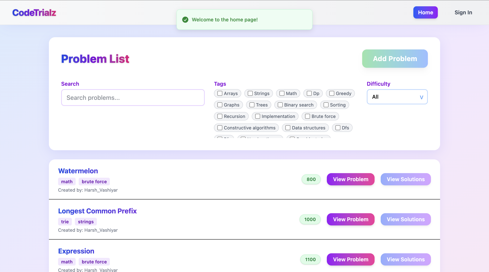
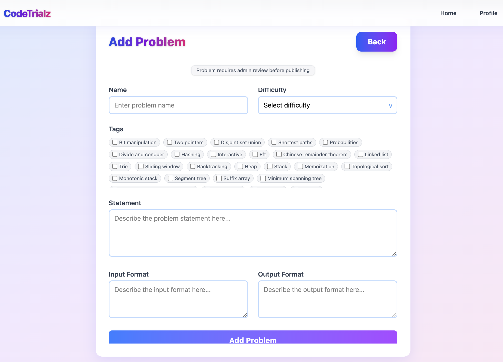
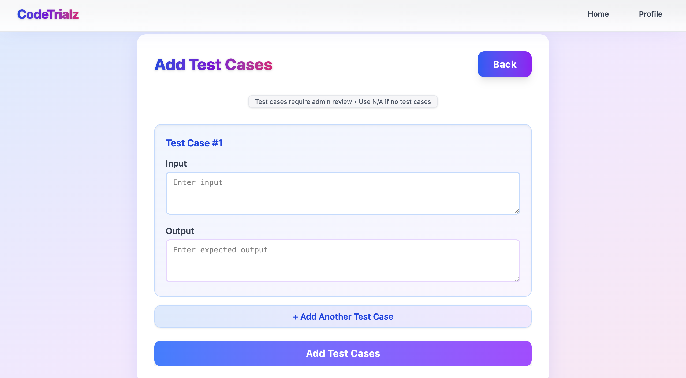
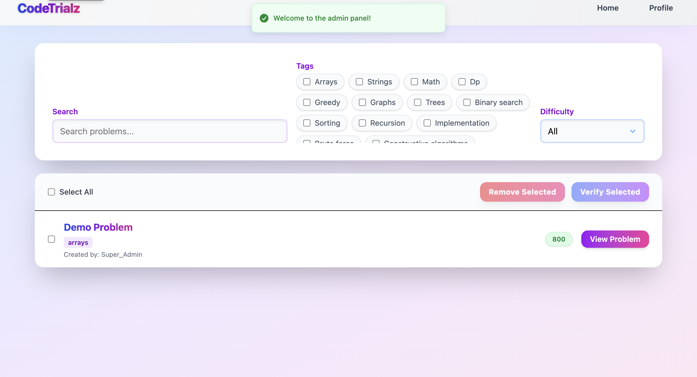
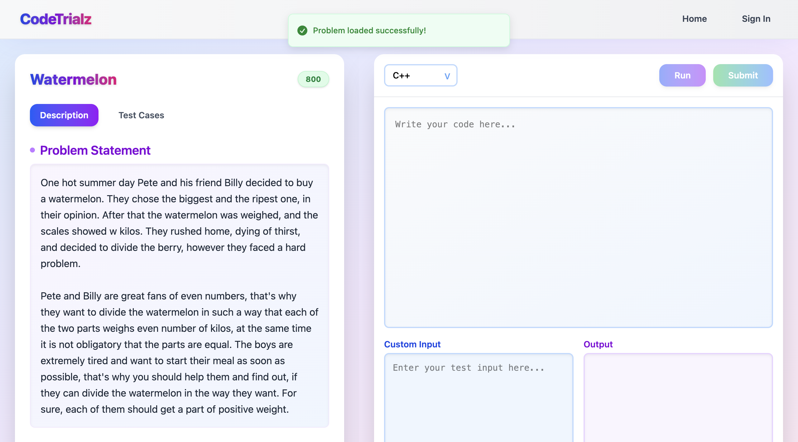
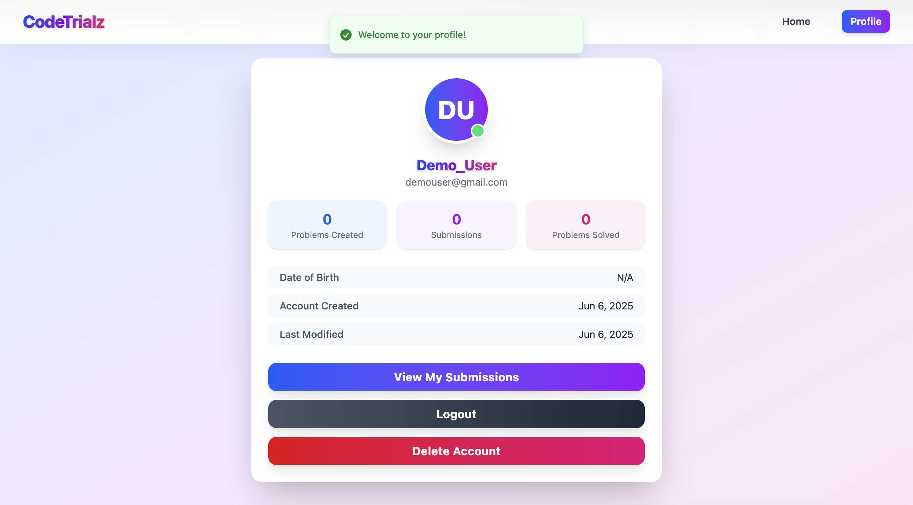
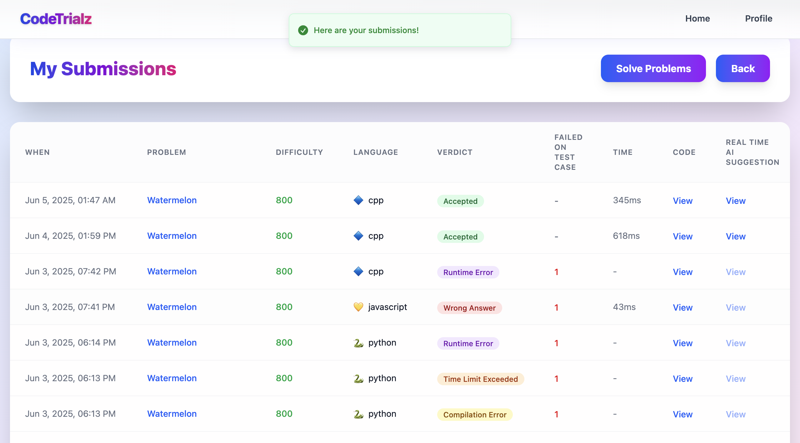

# Code Trialz 👨🏻‍⚖️ 

CodeTrialz is a full-stack **online judge platform** that enables users to register, solve coding challenges in multiple languages (C++, Python, JavaScript, Java), submit code for evaluation, and view detailed feedback. It also features admin verification, AI-powered suggestions for accepted solutions, and a microservices-based deployment architecture.

## 🌐 Live Demo

[https://code-trialz.harshvashiyar.in](https://code-trialz.harshvashiyar.in)

## 📋 Table of Contents

- [Features](#features)
- [Tech Stack](#tech-stack)
- [Architecture](#architecture)
- [Folder Structure](#folder-structure)
- [Getting Started](#getting-started)
<!-- - [Contributing](#contributing)
- [License](#license) -->

## 📦 Features

### User Authentication
Users can register using a valid email ID, which also allows them to securely reset their password if needed.

### Session Management
Upon signing in, users are assigned secure cookies to maintain their session.

### Challenge Creation
Authenticated users can create new coding problems and attach multiple custom test cases to each.

### Admin Verification
All submitted problems and test cases undergo an admin review process before being made publicly available.

### Code Submission Interface
Users can browse verified problems and solve them using an integrated code editor that supports four languages — C++, Python, JavaScript, and Java.

### Secure Execution
Code is executed inside isolated containers and automatically evaluated against the provided test cases.

### AI Suggestions
If a solution is accepted, users receive real-time AI-powered suggestions to enhance their code quality.

### User Profiles
Each user has a profile page where they can view their submission history and other details.

<!-- ## 📸 Screenshots

| Feature | Screenshot |
|--------|------------|
| Home Page |  |
| Add Problem |  |
| Add Test Cases |  |
| Admin Panel |  |
| Code Editor |  |
| Profile Page |  |
| Submission History |  | -->

## 🛠️ Tech Stack

### 🧑🏻‍💻 Frontend
- [React.js](https://reactjs.org/)
- [Vite](https://vitejs.dev/)
- [Tailwind CSS](https://tailwindcss.com/)
- [Axios](https://www.npmjs.com/package/axios)
- [React Router](https://reactrouter.com/)
- [Sonner](https://sonner.emilkowal.ski/)

### 🔁 Backend (General APIs)

- [Node.js](https://nodejs.org/en)
- [Express](https://expressjs.com/)
- [MongoDB](https://www.mongodb.com/) (via [Mongoose](https://www.npmjs.com/package/mongoose))
- [Cors](https://www.npmjs.com/package/cors) + [dotenv](https://www.npmjs.com/package/dotenv) for handling cross site requests and accessing environment variables.
- [Bcrypt](https://www.npmjs.com/package/bcrypt) hashing for password security
- [JWT](https://jwt.io/) + [cookie-parser](https://www.npmjs.com/package/cookie-parser) for cookies functionality
- Email support via [Nodemailer](https://www.npmjs.com/package/nodemailer)
- [Google Gemini GenAi](https://ai.google.dev/)
- [Docker](https://www.docker.com/) container on [AWS](https://aws.amazon.com/) [EC2](https://aws.amazon.com/ec2/)

### 🚚 Code Execution Microservice

- [Node.js](https://nodejs.org/en)
- [Express](https://expressjs.com/)
- [Cors](https://www.npmjs.com/package/cors) + [dotenv](https://www.npmjs.com/package/dotenv) for handling cross site requests and accessing environment variables.
- [uuid](https://www.npmjs.com/package/uuid) for managing code files
- Separate [Docker](https://www.docker.com/) container on a different [AWS](https://aws.amazon.com/) [EC2](https://aws.amazon.com/ec2/) instance

### 🐳 Containerization & Deployment
- The project follows a microservices architecture, split into two backend services:
  - `General API Service`: Handles authentication, problem CRUD, submission history, and AI integration.
  - `Code Execution Service`: Securely executes submitted code in isolated environments for C++, Python, JavaScript, and Java.
- 🧊 Backend Deployment:
    - Both microservices are containerized using Docker.
    - Each service is deployed on a separate AWS EC2 instance for isolation and scalability.
    - Docker containers are configured to restart automatically on failure for reliability.
- 🌐 Frontend Deployment:
    - Frontend is built with React + Vite and deployed on Vercel for seamless CI/CD and global edge delivery.
- 🌍 Custom Domain & SSL:
    - A custom domain was purchased via Hostinger.
    - The domain was mapped to both the frontend (Vercel) and backend (AWS EC2 instances) using DNS A and CNAME records.
    - HTTPS/SSL was enabled for the backend APIs using Certbot and Let’s Encrypt:
    - Backend Express servers were configured to serve via HTTPS using the generated SSL certificates.

## 🏛️ Architecture

[View In Canva](https://www.canva.com/design/DAGpwSHIplw/y4fJZKZJBZyTo17YCCJ5Qg/view?utm_content=DAGpwSHIplw&utm_campaign=designshare&utm_medium=link2&utm_source=uniquelinks&utlId=h04df009fc3)

## 📁 Folder Structure

```bash
CodeTrialz/
├── client/                     # Frontend - React + Vite
│   ├── src/
│   │   ├── pages/              # Page-level components
│   │   ├── components/         # Reusable UI components
│   │   └── contexts/           # React context for state management
│   └── .env                    # Frontend environment variables

├── server/
│   ├── CodeBackEnd/            # Microservice for code execution
│   │   ├── app.js
│   │   ├── codes/              # Stores user code temporarily
│   │   ├── inputs/             # Stores test inputs
│   │   ├── outputs/            # Stores output files
│   │   ├── routes/
│   │   ├── controllers/
│   │   ├── utilities/
│   │   ├── .env
│   │   ├── Dockerfile
│   │   └── .dockerignore

│   ├── app.js                  # Entry point for General API service
│   ├── routes/                 # Auth, problems, submissions routes
│   ├── controllers/            # Route controllers
│   ├── utilities/              # Helper functions/utilities
│   ├── models/                 # Mongoose schemas
│   ├── .env                    # General API environment variables
│   ├── Dockerfile              # Dockerfile for General API
│   └── .dockerignore
```

## 🚀 Getting Started

### 🔗 Clone & Install

```bash
# Clone repo
git clone https://github.com/HarshVashiyar/CodeTrialz.git
cd CodeTrialz

# Backend
cd server
npm install
cp .env.example .env
npm run dev

# Code Execution Service
cd CodeBackEnd
npm install
cp .env.example .env
npm run dev

# Frontend
cd ../../client
npm install
npm run dev
```